# Four-Body Orbital Integrator

A modern C++17 reimplementation of a four-body coplanar gravitational integrator,
originally written in FORTRAN and C++ (Visual Studio 6.0, 2003).

The core numerical algorithm is Everhart's **RA15** — a 15th-order Gauss-Radau
integrator — which is one of the most accurate methods for long-term orbital
integration. No FORTRAN compiler or legacy DLL is required.

---

## Repository structure

```
FourBodyIntegrator_Modern/
├── FourBodyIntegrator.sln          Visual Studio 2022 solution
│
├── Integrator/                     Static library: the integration engine
│   ├── include/
│   │   ├── Force.h                 Gravitational force function declaration
│   │   └── RA15.h                  RA15 integrator declaration
│   └── src/
│       ├── Force.cpp               Pairwise accelerations for 4 bodies
│       └── RA15.cpp                Everhart RA15 algorithm (C++17)
│
└── FourBody/                       Console application: simulation driver
    ├── src/
    │   └── main.cpp                Reads initial conditions, runs simulation
    └── data/
        └── initialcond.txt         Sample initial conditions (4 equal masses)
```

---

## Building

**Requirements:** Visual Studio 2022 with the "Desktop development with C++" workload.

1. Open `FourBodyIntegrator.sln`
2. Select configuration **Release | x64** (or Debug for debugging)
3. Press **Ctrl+Shift+B** to build both projects

The build order is automatic: `Integrator` (static lib) is built first,
then `FourBody` links against it.

---

## Running

The executable reads an initial conditions file and writes a trajectory file.

**Default paths** (relative to the `FourBody/` project directory):
- Input:  `data/initialcond.txt`
- Output: `result1.txt`

**Optional command-line overrides:**
```
FourBody.exe [input_file] [output_file]
```

**From the command line:**
```
cd FourBody
x64\Release\FourBody.exe data\initialcond.txt result1.txt
```

**From Visual Studio:** The working directory is set to the `FourBody/` project
folder automatically (configured in `FourBody.vcxproj`), so pressing F5 will
find `data/initialcond.txt` without any extra setup.

---

## Initial conditions file format

Plain text, one value per line, no comments:

```
x0          <- position of body 0 (x)
y0          <- position of body 0 (y)
x1          <- position of body 1 (x)
y1          <- position of body 1 (y)
x2
y2
x3
y3
vx0         <- velocity of body 0 (x)
vy0
vx1
vy1
vx2
vy2
vx3
vy3
m0          <- mass of body 0
m1
m2
m3
T           <- total simulation time
```

All values are in natural (dimensionless) units with G = 1.

---

## Output file format

Space-separated, 18 columns per line, 20 decimal places:

```
time  x0 y0 x1 y1 x2 y2 x3 y3  vx0 vy0 vx1 vy1 vx2 vy2 vx3 vy3  energy
```

The first line is a `#` header. The final line of stdout reports the
maximum fractional energy drift `|dE/E0|` observed over the full run.

---

## Integration parameters

Defined in `main.cpp` and easily adjusted:

| Parameter | Default | Description |
|-----------|---------|-------------|
| `ll` | `8` | Adaptive accuracy: ss = 10⁻⁸ per Radau sequence |
| `outputInterval` | `0.1` | Time between recorded snapshots |
| `nclass` | `-2` | Conservative second-order: y'' = F(y, t) |

`ll` controls the adaptive step size — higher values give more accuracy at
the cost of more force evaluations per sequence. Typical range: 6–12.
Set `ll` negative to use a fixed step size equal to `outputInterval`.

To change the total integration time, edit `T` in `data/initialcond.txt`.

---

## The RA15 algorithm

RA15 (Radau, 15th order) uses eight Gauss-Radau quadrature points per
sequence to build a 15th-degree polynomial approximation to the solution.
Key properties:

- **Order 15** — extremely low truncation error for smooth orbital problems
- **Adaptive step size** — automatically adjusts to maintain a target accuracy
- **Conservative systems** — uses the specialised y'' = F(y, t) code path
  (NCLASS = -2), which exploits time-reversal symmetry for better energy conservation
- **Self-starting** — no separate predictor stage required

### References

- E. Everhart, *"An efficient integrator that uses Gauss-Radau spacings"*,
  in *Dynamics of Comets: Their Origin and Evolution*, A. Carusi & G. B.
  Valsecchi (eds.), Reidel, Dordrecht, 1985, pp. 185–202.

---

## Equations of motion

Four coplanar bodies in barycentric coordinates, G = 1:

$$\ddot{\mathbf{r}}_i = \sum_{j \neq i} \frac{m_j (\mathbf{r}_j - \mathbf{r}_i)}{|\mathbf{r}_j - \mathbf{r}_i|^3}$$

Total energy (conserved quantity monitored at every step):

$$E = \underbrace{\frac{1}{2}\sum_i m_i |\dot{\mathbf{r}}_i|^2}_{K} - \underbrace{\sum_{i < j} \frac{m_i m_j}{|\mathbf{r}_i - \mathbf{r}_j|}}_{U}$$

---

## Results & Visualisation

The included Python script generates publication-quality figures from `result1.txt`:

```
pip install matplotlib numpy
python FourBody\plot_orbits.py FourBody\result1.txt
python FourBody\plot_extra.py  FourBody\result1.txt
```

The sample run uses 4 equal masses (m = 1) placed at the corners of a unit
square with the exact circular-orbit velocity (v = 0.978).  The system
rotates as a rigid square for ~7 orbits before instability sets in at t ≈ 44,
after which the motion becomes chaotic.

---

### Orbit trajectories

Full fading-trail paths of all 4 bodies over T = 100.
Hollow markers = start, filled markers = end.

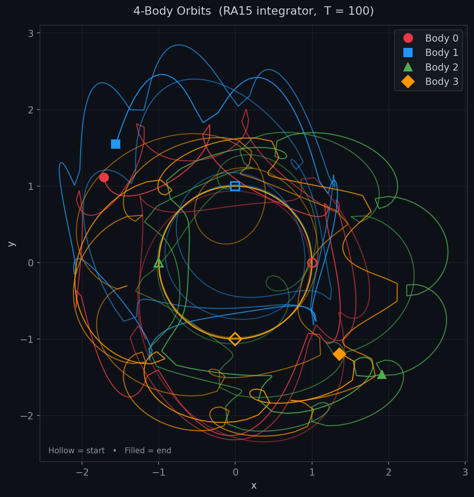

---

### Phase snapshots — early, middle, late

The early panel confirms a **perfect circular orbit**; chaos develops by the middle phase.

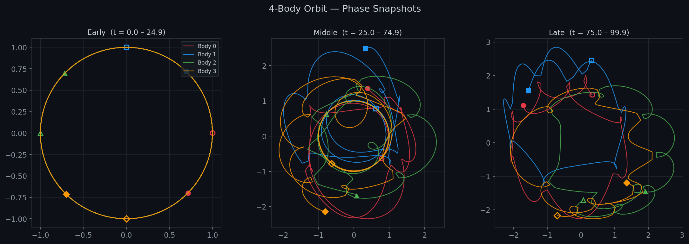

---

### Stability breakdown (t = 35 to 65)

Zoomed view of the transition from regular to chaotic motion, with pairwise
separations showing the moment all six distances simultaneously diverge from
their constant values.

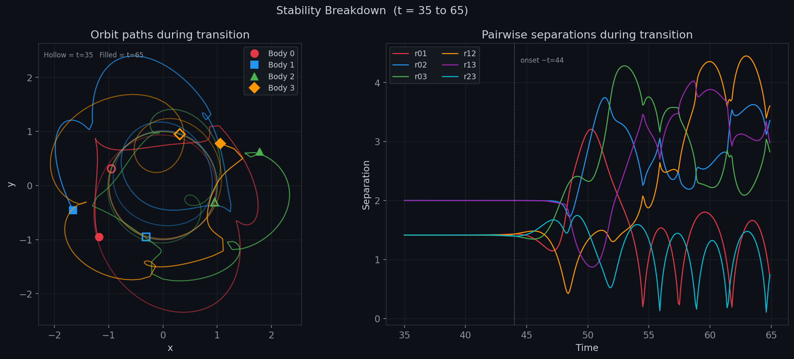

---

### Pairwise separations

All six body-to-body distances vs time. The flat lines until t ≈ 44 confirm
the square formation is maintained exactly; a close encounter then breaks it.

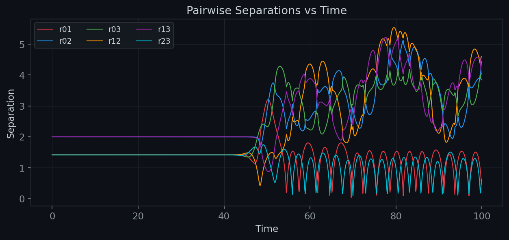

---

### Phase portraits

Each body's position–velocity phase space (x vs vx, y vs vy), coloured by
time (dark = early, bright = late).  The tight loops of the regular phase
scatter into a chaotic attractor after the stability break.

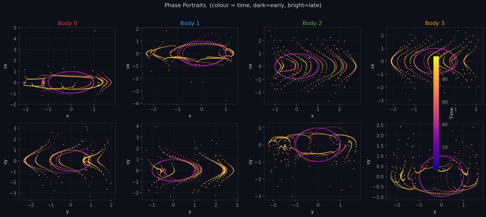

---

### Speed profiles

Speed |v| of each body vs time — constant at 0.978 during the circular
phase, then oscillating wildly after the close encounter at t ≈ 54.

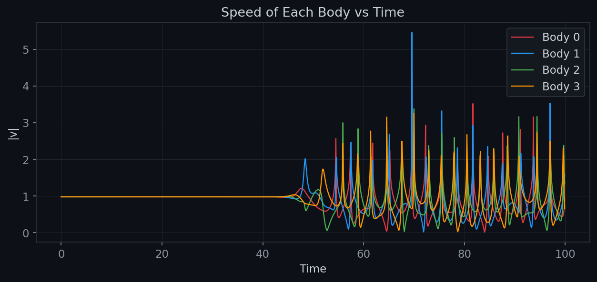

---

### Angular momentum conservation

Total Lz = Σ mᵢ (xᵢ vyᵢ − yᵢ vxᵢ) is conserved to **3 × 10⁻¹⁰** (relative)
during the regular phase — consistent with 15th-order accuracy.

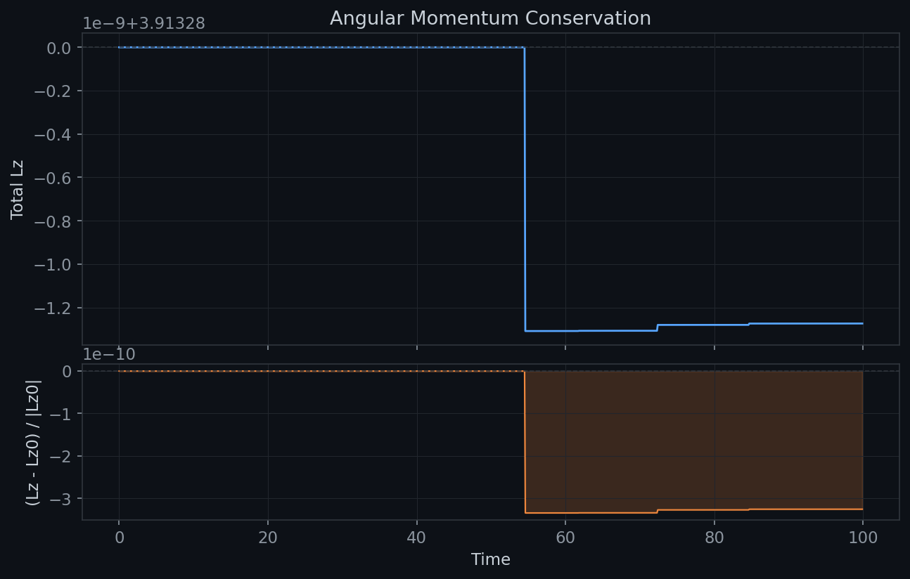

---

### Centre of mass

CoM position drifts by only **~10⁻¹¹** over the full run, confirming that
the barycentric coordinate constraint is satisfied to near machine precision.

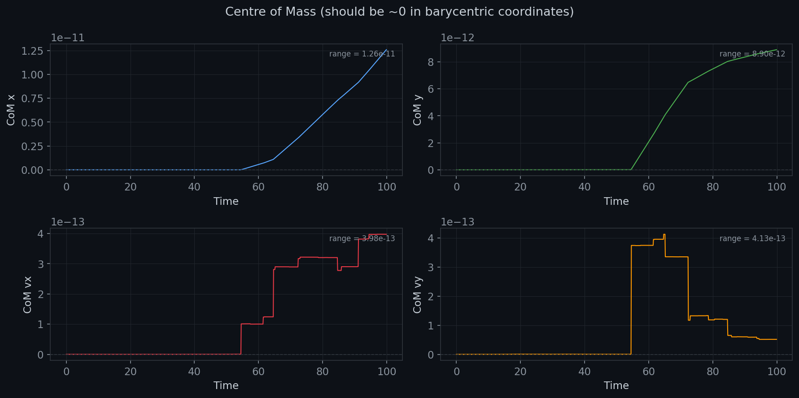

---

## Further examples — comparative initial conditions

The script `FourBody/plot_examples.py` re-runs the integrator with three
alternative IC sets and generates `orbit_phases` and `phase_portrait` figures
for each.  Run it with no arguments:

```
python FourBody\plot_examples.py
```

---

### Example 1 — Larger square (R = 2, T = 200)

Bodies placed at the corners of a diamond of radius 2, given the exact
circular-orbit speed v = 0.691.  The system is qualitatively similar to
the unit square but evolves more slowly; chaotic breakdown arrives later
and the trajectories spread over a wider region before scattering.

**Phase snapshots**

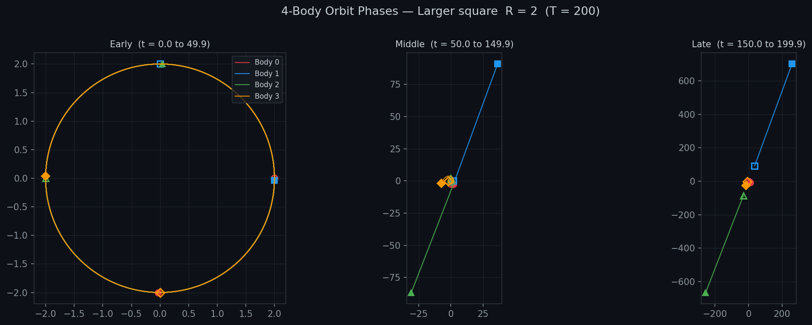

**Phase portraits** (colour = time: dark early → bright late)

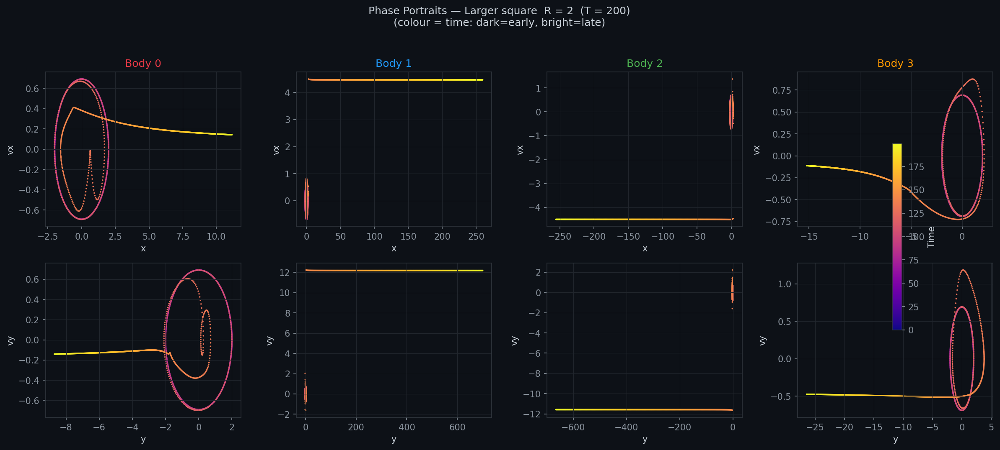

---

### Example 2 — Tight square (R = 0.5, T = 30)

A compact configuration with radius 0.5 and correspondingly faster orbital
speed v = 1.384.  The higher velocities and shorter inter-body distances
accelerate the onset of instability; the system leaves the regular orbit
within a few periods and quickly explores large regions of phase space.

**Phase snapshots**

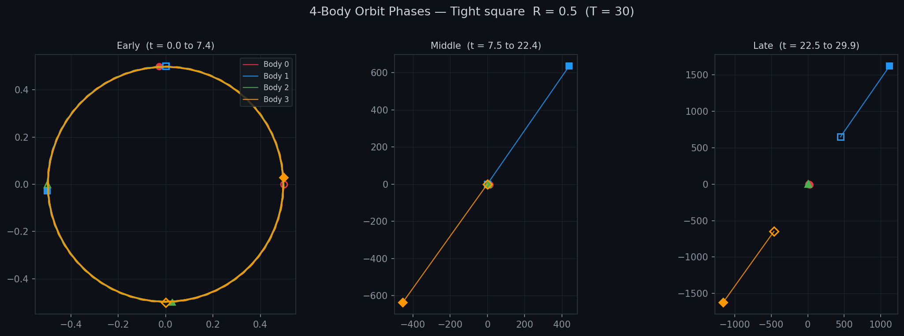

**Phase portraits**

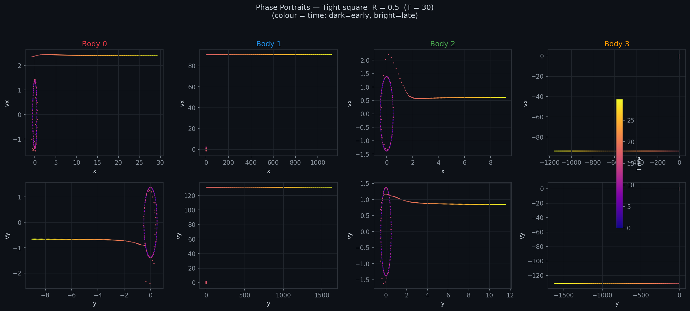

---

### Example 3 — Hierarchical binary-binary (T = 300)

Two close binaries (pair separation 1, pair–pair separation 8) are given
velocities that simultaneously maintain each binary orbit and the slow
mutual orbit of the two pairs.  The integrator conserves energy to
**~3 × 10⁻¹⁴** over 300 time units — a demanding test of the RA15
algorithm on a near-integrable hierarchical problem.

The early and middle phase snapshots show the two binary loops clearly
separated; the late panel captures the eventual secular drift as the outer
orbit perturbs the inner pairs.

**Phase snapshots**

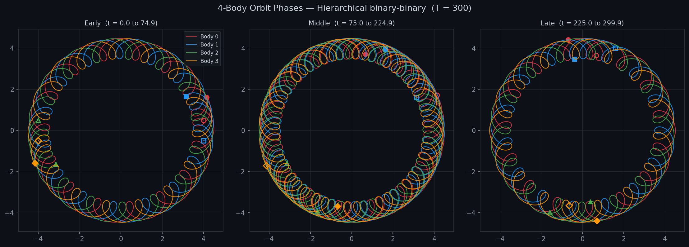

**Phase portraits**

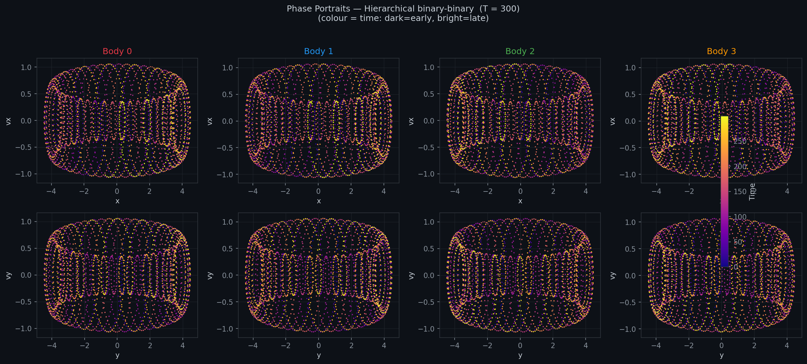

---

## Differences from the original (2003) code

| Original | This version |
|----------|-------------|
| FORTRAN `.for` files + C++ DLL | Pure C++17, no external dependencies |
| Visual Studio 6.0 `.dsp`/`.dsw` | Visual Studio 2022 `.sln`/`.vcxproj` |
| 32-bit only | x64 target |
| Fixed-size FORTRAN arrays | `std::vector` with bounds-safe access |
| Computed `GO TO` statements | `switch` statements (identical numeric behaviour) |
| Three projects (DLL, console app, MFC GUI) | Two projects (static lib + console app) |
| Output file only | Header line + optional command-line paths |
